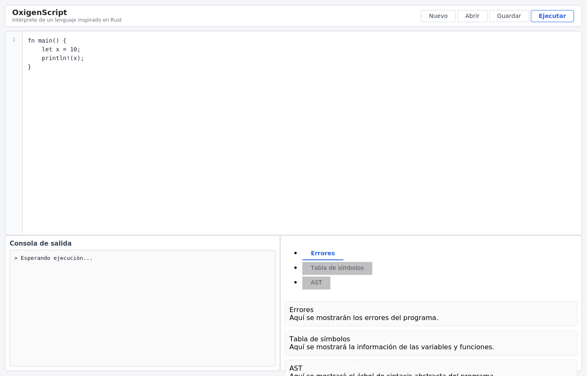
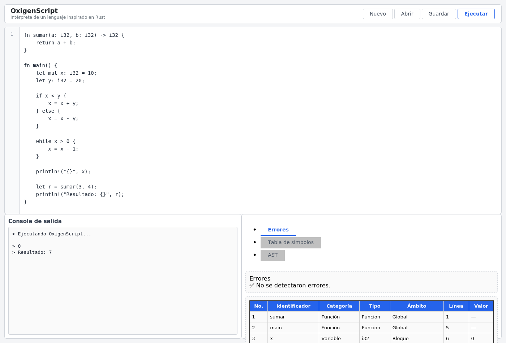
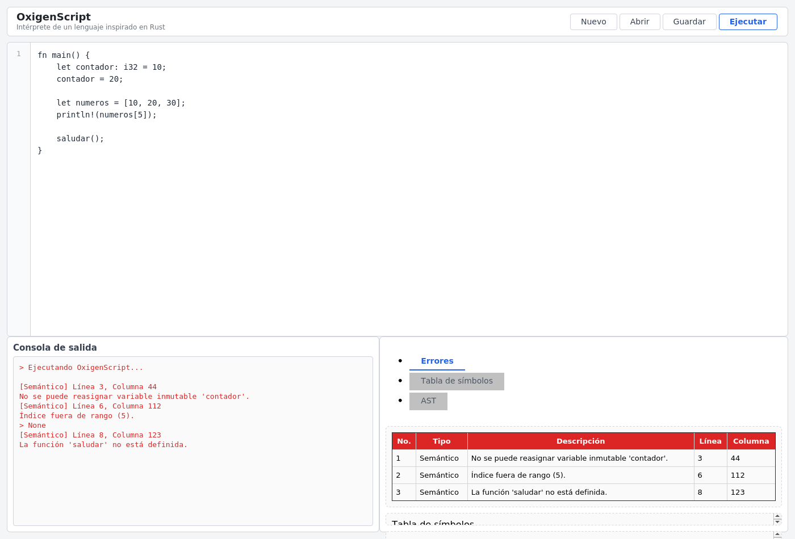
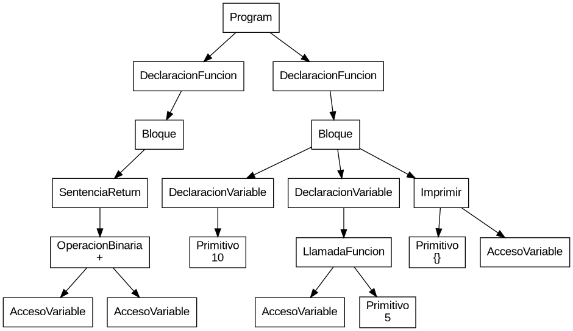

# Manual de Usuario — OxigenScript


Este manual explica paso a paso cómo instalar, ejecutar y usar el intérprete
de OxigenScript, así como interpretar los reportes que genera (consola,
errores, tabla de símbolos y AST).

---

## 1. Requisitos previos

| Requisito | Detalle |
|---|---|
| Python | 3.10 o superior |
| Graphviz (binario `dot`) | Necesario para generar el reporte de AST (`.png`, `.pdf`, `.svg`) |
| Navegador web | Para usar la interfaz gráfica |

Instalación de Graphviz en Linux (Debian/Ubuntu):

```bash
sudo apt-get update
sudo apt-get install graphviz
```

Verifique que el comando esté disponible:

```bash
dot -V
```

## 2. Instalación del proyecto

1. Descomprima el repositorio `OLC2_N_P1_2S2026` (o clónelo desde GitHub) y
   entre a la carpeta del proyecto:

   ```bash
   cd OLC2_N_P1_2S2026
   ```

2. (Recomendado) Cree un entorno virtual:

   ```bash
   python3 -m venv venv
   source venv/bin/activate      # En Windows: venv\Scripts\activate
   ```

3. Instale las dependencias:

   ```bash
   pip install -r requirements.txt
   ```

   Esto instala `Flask` (servidor web/API) y `ply` (Python Lex-Yacc, usado
   para el análisis léxico y sintáctico).

## 3. Ejecutar la herramienta

El proyecto se levanta con `app.py`, que inicia el servidor Flask:

```bash
python3 app.py
```

Verá algo como:

```
 * Serving Flask app 'app'
 * Debug mode: on
 * Running on http://127.0.0.1:5000
```

Abra su navegador en **http://127.0.0.1:5000** para acceder a la interfaz.

> **Nota:** el archivo `main.py` es un script de prueba de consola
> (no inicia el servidor web); ejecuta un programa OxigenScript de ejemplo
> directamente por terminal y muestra la tabla de símbolos resultante.
> Es útil para depuración rápida del intérprete sin usar el navegador:
> ```bash
> python3 main.py
> ```

## 4. La interfaz gráfica



La interfaz se organiza en cuatro áreas:

1. **Barra superior**: nombre de la herramienta y los botones **Nuevo**,
   **Abrir**, **Guardar** y **Ejecutar**.
2. **Editor de código** (centro): área de texto con numeración de líneas
   donde se escribe el programa en OxigenScript.
3. **Consola de salida** (abajo-izquierda): muestra el resultado de
   `println!(...)`, mensajes de estado de la compilación/ejecución y los
   errores detectados.
4. **Panel de reportes** (abajo-derecha), con tres pestañas:
   - **Errores**: tabla con tipo, descripción, línea y columna de cada
     error léxico, sintáctico o semántico detectado.
   - **Tabla de símbolos**: identificador, categoría (Variable, Función,
     Struct), tipo, ámbito, línea de declaración y valor.
   - **AST**: representación gráfica del árbol de sintaxis abstracta del
     programa, generada con Graphviz.

## 5. Crear, editar y ejecutar código

###  Escribir o cargar un programa

- **Nuevo**: limpia el editor para empezar un programa desde cero.
- **Abrir**: abre el explorador de archivos del sistema operativo para
  cargar un archivo de texto (`.ox`, `.rs`, `.txt`) en el editor.
- También puede escribir o pegar directamente el código en el editor.

###  Ejecutar

Presione el botón **Ejecutar** (o **▶**). La interfaz enviará el contenido
del editor al backend (`POST /ejecutar`) y, cuando la respuesta llegue,
actualizará automáticamente:

- La consola de salida.
- La pestaña de Errores.
- La pestaña de Tabla de símbolos.
- La pestaña de AST.

**Ejemplo — ejecución exitosa:**

```rust
fn sumar(a: i32, b: i32) -> i32 {
    return a + b;
}

fn main() {
    let mut x: i32 = 10;
    let y: i32 = 20;

    if x < y {
        x = x + y;
    } else {
        x = x - y;
    }

    while x > 0 {
        x = x - 1;
    }

    println!("{}", x);

    let r = sumar(3, 4);
    println!("Resultado: {}", r);
}
```



###  Guardar

Presione **Guardar** para descargar el contenido actual del editor como
archivo de texto en su equipo.

## 6. Interpretando los reportes

###  Consola de salida

Muestra, en orden, el resultado de cada `println!(...)` ejecutado por el
programa. Si ocurrieron errores semánticos durante la ejecución, también se
imprimen ahí con el formato:

```
[Tipo] Línea <línea>, Columna <columna>
Descripción del error.
```

###  Pestaña Errores

Presenta en una tabla **todos** los errores detectados durante las tres
fases del análisis (léxico, sintáctico y semántico). El intérprete es
resiliente: no se detiene en el primer error, sino que intenta continuar el
análisis y la ejecución del resto del programa para reportar la mayor
cantidad de errores posible en una sola ejecución.

**Ejemplo — programa con errores intencionales:**

```rust
fn main() {
    let contador: i32 = 10;
    contador = 20;               // variable inmutable

    let numeros = [10, 20, 30];
    println!(numeros[5]);        // índice fuera de rango

    saludar();                   // función no declarada
}
```



Note que, a pesar de los tres errores, el programa reportó los tres en una
sola ejecución en lugar de detenerse en el primero.

###  Pestaña Tabla de símbolos

Lista cada identificador registrado durante la ejecución (variables,
parámetros de función, funciones y structs), indicando:

| Columna | Significado |
|---|---|
| No. | Número consecutivo |
| Identificador | Nombre de la variable/función/struct |
| Categoría | `Variable`, `Función` o `Struct` |
| Tipo | Tipo de dato (`i32`, `f64`, `bool`, `String`, `char`, `[T]`, o el nombre del struct) |
| Ámbito | `Global`, `Bloque`, o `Funcion_<nombre>` según dónde fue declarado |
| Línea | Línea del código fuente donde se declaró |
| Valor | Valor que tenía al finalizar la ejecución (`—` para funciones/structs) |

Además de en la interfaz, este reporte se guarda como archivo autónomo
`reporte_simbolos.html` en la raíz del proyecto cada vez que se ejecuta un
programa.

###  Pestaña AST

Muestra el árbol de sintaxis abstracta del programa, generado con
Graphviz. Cada nodo indica el tipo de construcción sintáctica
(`DeclaracionVariable`, `OperacionBinaria`, `LlamadaFuncion`, etc.) y las
aristas representan la relación padre-hijo entre las instrucciones y
expresiones del programa.



Adicionalmente al SVG mostrado en la interfaz, cada ejecución genera en la
raíz del proyecto los archivos:

- `reporte_ast.dot` — código fuente del grafo (formato DOT).
- `reporte_ast.png` — imagen rasterizada.
- `reporte_ast.pdf` — versión para impresión/documentación.
- `reporte_ast.svg` — versión vectorial (la que se incrusta en la web).

## 7. Ejemplo de sesión de uso completa

1. Se abre `http://127.0.0.1:5000` → aparece el programa de ejemplo por
   defecto en el editor.
2. Se reemplaza el código por un programa propio (o se abre un archivo
   `.ox` con **Abrir**).
3. Se presiona **Ejecutar**.
4. Se revisa la **Consola** para confirmar que la salida es la esperada.
5. Si hay errores, se abre la pestaña **Errores**, se corrige el código
   línea por línea según la columna/línea indicada, y se vuelve a ejecutar.
6. Se usa la pestaña **Tabla de símbolos** para verificar el tipo y el
   valor final de cada variable.
7. Se usa la pestaña **AST** para verificar que la estructura del programa
   se interpretó como se esperaba (por ejemplo, la precedencia de
   operadores en una expresión aritmética).
8. Se presiona **Guardar** para descargar el archivo final.

## 8. Solución de problemas

| Problema | Causa probable | Solución |
|---|---|---|
| La pestaña AST aparece vacía o solo dice "Error en Análisis" | Hay errores léxicos/sintácticos que impiden construir el AST | Revise primero la pestaña **Errores** |
| `dot: command not found` en la consola del servidor | Graphviz no está instalado a nivel de sistema | Instale Graphviz (ver sección 1) |
| El puerto 5000 está ocupado | Otra aplicación usa ese puerto | Cambie `port=5000` por otro puerto en `app.py`, al final del archivo |
| Los cambios de código no se ven reflejados | El navegador cacheó la página | Recargue con Ctrl+F5 (recarga forzada) |
